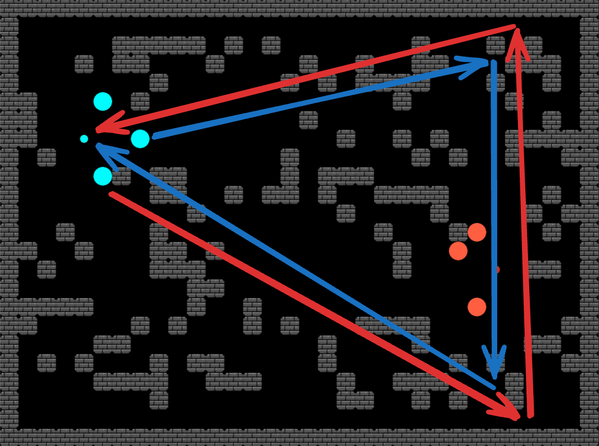

# Capture The Flag Agent

This project is a game where agents compete to capture the enemy's flag. The agents use a breadth-first pathfinding algorithm to locate and capture the enemy flag while also avoiding or shooting at enemy agents.

## Game Mechanics

In the game, each team has a flag and the objective is to capture the enemy's flag and bring it back to your base. The game ends when one team successfully captures the enemy's flag.

## Agent Behavior

The agents in this game have different roles and tactics:

1. **Guardian Agent**: This agent is programmed to always guard the flag. It does this by continuously circling around its own flag, ready to intercept any enemy agents that come near.

2. **Search Agents**: The other two agents are tasked with finding and capturing the enemy flag. They employ a divide-and-conquer strategy where one agent goes to the top opposite corner and then heads to the bottom corner, while the other agent does the opposite. This tactic ensures that they cover the entire enemy territory. If an agent doesn't find the flag in its assigned area, it moves back to its base.

By using these tactics, the agents can effectively defend their flag while also increasing their chances of capturing the enemy's flag.



## How to Run

To run this game, ensure you have Python installed on your machine and follow these steps:

1. Clone this repository to your local machine using

```
git clone https://github.com/marinactonci/CaptureTheFlagAgent.git
```

2. Navigate into the project directory:

```
cd CaptureTheFlagAgent
```

3. Run the game using the command:

```
python main.py
```

Codes for both the blue and red agents are exactly the same. Change either one freely to your own will and try to beat my agent 😃. 
